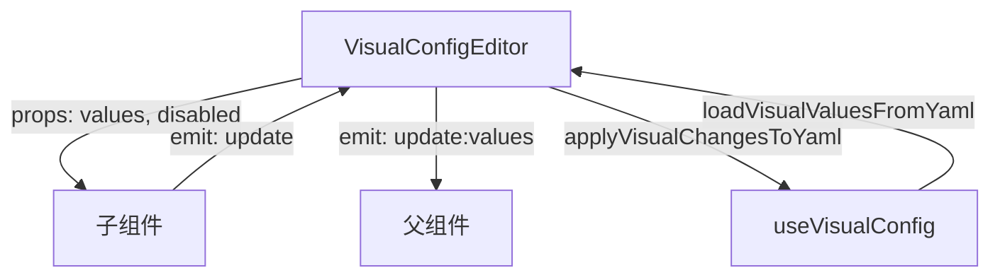

# Design Document

## Overview

本设计文档描述了 CLIProxyAPIPanel 可视化配置编辑器的重构方案。核心思路是将现有的单一大组件拆分为多个职责单一的子组件，并扩展类型定义和 composable 以支持所有配置项。

## Architecture

### 组件层次结构

```
VisualConfigEditor.vue (主容器)
├── ServerConfigSection.vue      # 服务器配置
├── TlsConfigSection.vue         # TLS 配置
├── RemoteManagementSection.vue  # 远程管理配置
├── AuthConfigSection.vue        # 认证配置
├── SystemConfigSection.vue      # 系统配置
├── NetworkConfigSection.vue     # 网络配置
├── QuotaConfigSection.vue       # 配额回退配置
├── StreamingConfigSection.vue   # 流式传输配置
├── GeminiApiConfigSection.vue   # Gemini API 配置
├── CodexApiConfigSection.vue    # Codex API 配置
├── ClaudeApiConfigSection.vue   # Claude API 配置
├── OpenAICompatibilitySection.vue # OpenAI 兼容配置
├── VertexApiConfigSection.vue   # Vertex API 配置
├── AmpcodeConfigSection.vue     # Ampcode 配置
├── OAuthModelMappingsSection.vue # OAuth 模型映射
├── OAuthExcludedModelsSection.vue # OAuth 排除模型
└── PayloadConfigSection.vue     # Payload 配置
```

### 数据流



## Components and Interfaces

### 1. 主容器组件 (VisualConfigEditor.vue)

```typescript
// Props
interface Props {
  values: VisualConfigValues
  disabled?: boolean
}

// Emits
interface Emits {
  (e: 'update:values', values: Partial<VisualConfigValues>): void
}
```

### 2. 子组件通用接口

所有子组件遵循统一的接口模式：

```typescript
// 通用 Props 模式
interface SectionProps<T> {
  values: T           // 该组件需要的配置值子集
  disabled?: boolean  // 是否禁用编辑
}

// 通用 Emits 模式
interface SectionEmits<T> {
  (e: 'update', values: Partial<T>): void
}
```

### 3. API 密钥配置组件通用结构

Gemini、Codex、Claude、Vertex API 配置组件共享相似结构：

```typescript
interface ApiKeyEntry {
  id: string
  apiKey: string
  prefix?: string
  baseUrl?: string
  proxyUrl?: string
  headers?: Record<string, string>
  models?: ModelMapping[]
  excludedModels?: string[]
}

interface ModelMapping {
  id: string
  name: string
  alias: string
}
```

### 4. 可复用子组件

```typescript
// 键值对编辑器
interface KeyValueEditorProps {
  modelValue: Record<string, string>
  disabled?: boolean
  keyPlaceholder?: string
  valuePlaceholder?: string
}

// 模型映射编辑器
interface ModelMappingEditorProps {
  modelValue: ModelMapping[]
  disabled?: boolean
}

// 字符串列表编辑器
interface StringListEditorProps {
  modelValue: string[]
  disabled?: boolean
  placeholder?: string
}
```

## Data Models

### 扩展的 VisualConfigValues 类型

```typescript
// 流式传输配置
interface StreamingConfig {
  keepaliveSeconds: string
  bootstrapRetries: string
}

// API 密钥条目（通用）
interface ApiKeyEntry {
  id: string
  apiKey: string
  prefix?: string
  baseUrl?: string
  proxyUrl?: string
  headers: HeaderEntry[]
  models: ModelMappingEntry[]
  excludedModels: string[]
}

interface HeaderEntry {
  id: string
  key: string
  value: string
}

interface ModelMappingEntry {
  id: string
  name: string
  alias: string
}

// OpenAI 兼容提供商
interface OpenAICompatibilityEntry {
  id: string
  name: string
  prefix?: string
  baseUrl: string
  headers: HeaderEntry[]
  apiKeyEntries: ApiKeySubEntry[]
  models: ModelMappingEntry[]
}

interface ApiKeySubEntry {
  id: string
  apiKey: string
  proxyUrl?: string
}

// Ampcode 上游 API 密钥映射
interface AmpUpstreamApiKeyMapping {
  id: string
  upstreamApiKey: string
  apiKeys: string[]
}

// OAuth 排除模型
interface OAuthExcludedModelsConfig {
  [channel: string]: string[]
}

// 扩展后的完整类型
interface VisualConfigValues {
  // 现有字段...
  
  // 新增字段
  streaming: StreamingConfig
  geminiApiKeys: ApiKeyEntry[]
  codexApiKeys: ApiKeyEntry[]
  claudeApiKeys: ApiKeyEntry[]
  openaiCompatibility: OpenAICompatibilityEntry[]
  vertexApiKeys: ApiKeyEntry[]
  ampUpstreamApiKeys: AmpUpstreamApiKeyMapping[]
  oauthExcludedModels: OAuthExcludedModelsConfig
}
```

## Correctness Properties


*A property is a characteristic or behavior that should hold true across all valid executions of a system-essentially, a formal statement about what the system should do. Properties serve as the bridge between human-readable specifications and machine-verifiable correctness guarantees.*

### Property 1: 配置值变化事件传播

*For any* 配置值的变化（无论来自哪个子组件），Visual_Config_Editor 都应该正确合并更新并触发 update:values 事件，且事件携带的值应包含所有变化的字段。

**Validates: Requirements 1.2, 1.4**

### Property 2: TLS 条件渲染

*For any* TLS 启用状态，当 tlsEnable 为 true 时，证书和私钥输入框应该可见；当 tlsEnable 为 false 时，这些输入框应该隐藏。

**Validates: Requirements 3.2, 3.3**

### Property 3: API 密钥列表操作一致性

*For any* API 密钥配置组件（Gemini、Codex、Claude、Vertex），添加一个新条目后列表长度应增加1，删除一个条目后列表长度应减少1，且列表中的其他条目应保持不变。

**Validates: Requirements 10.1, 10.9, 11.1, 11.3, 12.1, 12.3, 14.1, 14.3**

### Property 4: YAML 解析-序列化 Round Trip

*For any* 有效的配置 YAML 字符串，经过 loadVisualValuesFromYaml 解析后再通过 applyVisualChangesToYaml 序列化，应该产生语义等价的 YAML（配置值相同，忽略格式差异）。

**Validates: Requirements 20.1, 20.2, 20.3, 20.4, 20.5, 20.6, 20.7, 20.8**

### Property 5: Streaming 禁用提示显示

*For any* keepalive-seconds 值，当值为 0、空字符串或未定义时，应显示"已禁用"提示；当值大于 0 时，不应显示该提示。

**Validates: Requirements 9.3**

## Error Handling

### 输入验证

1. **端口号验证**: port 字段应只接受有效的端口号（1-65535）
2. **URL 验证**: proxy-url、base-url 等字段应验证 URL 格式
3. **数字字段验证**: 数字类型字段应拒绝非数字输入

### YAML 解析错误

1. 当 YAML 解析失败时，使用默认值初始化
2. 当特定字段解析失败时，该字段使用默认值，不影响其他字段

### 空值处理

1. 可选字段为空时不写入 YAML
2. 布尔字段为 false 时根据默认值决定是否写入

## Testing Strategy

### 单元测试

使用 Vitest 进行单元测试：

1. **组件渲染测试**: 验证各子组件正确渲染所需的 UI 元素
2. **事件触发测试**: 验证值变化时正确触发 update 事件
3. **条件渲染测试**: 验证条件显示/隐藏逻辑

### 属性测试

使用 fast-check 进行属性测试：

1. **Round Trip 测试**: 验证 YAML 解析和序列化的一致性
2. **列表操作测试**: 验证添加/删除操作的正确性
3. **事件传播测试**: 验证配置变化的正确传播

### 测试配置

- 每个属性测试运行至少 100 次迭代
- 使用 @vue/test-utils 进行组件测试
- 测试文件与源文件同目录，使用 `.test.ts` 后缀

## Implementation Notes

### 文件组织

```
src/components/config/
├── VisualConfigEditor.vue      # 主容器（重构）
├── ConfigSection.vue           # 通用区块容器（已有）
├── sections/                   # 配置区块子组件
│   ├── ServerConfigSection.vue
│   ├── TlsConfigSection.vue
│   ├── RemoteManagementSection.vue
│   ├── AuthConfigSection.vue
│   ├── SystemConfigSection.vue
│   ├── NetworkConfigSection.vue
│   ├── QuotaConfigSection.vue
│   ├── StreamingConfigSection.vue
│   ├── GeminiApiConfigSection.vue
│   ├── CodexApiConfigSection.vue
│   ├── ClaudeApiConfigSection.vue
│   ├── OpenAICompatibilitySection.vue
│   ├── VertexApiConfigSection.vue
│   ├── AmpcodeConfigSection.vue
│   ├── OAuthModelMappingsSection.vue
│   ├── OAuthExcludedModelsSection.vue
│   └── PayloadConfigSection.vue
├── editors/                    # 可复用编辑器组件
│   ├── KeyValueEditor.vue
│   ├── ModelMappingEditor.vue
│   ├── StringListEditor.vue
│   └── ApiKeyEntryEditor.vue
└── index.ts                    # 导出
```

### 依赖

- Vue 3 Composition API
- TypeScript
- 现有 UI 组件库（Input、Switch、Textarea、SearchableSelect 等）
- yaml 库（解析和序列化）
